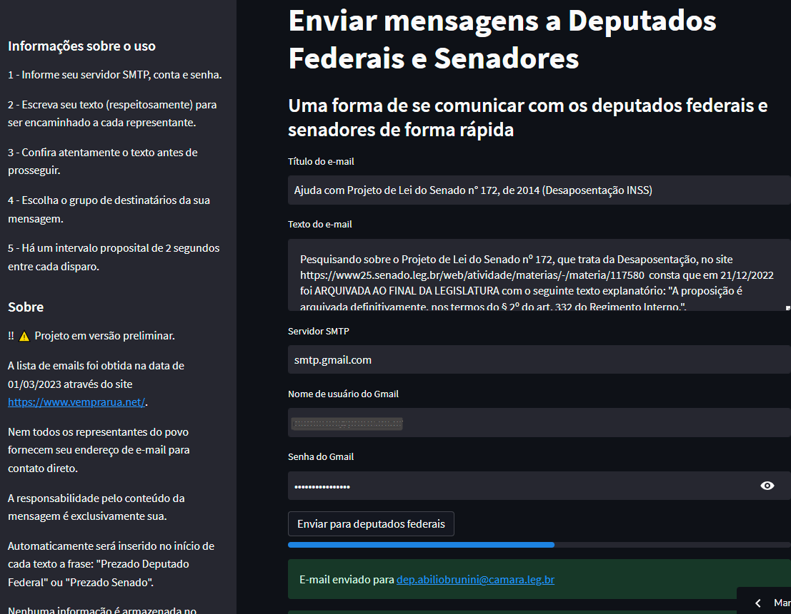

Projeto: Um script para enviar uma mensagem de email a cada deputado federal ou senador   
Autor: Hamilton Tenório da Silva    
Date: 01/03/2023    

Veja es projeto em funcionamento em https://htsnet-emailsenadoresdeputados-app-p959uw.streamlit.app/  

Projeto criado em Python, como uso do Streamlit e praticamente todo o script foi gerado por comandos progressivos junto ao chatGPT.  

------ Instructions ------
python -m pip install pip // para instalar o PIP   
pip install virtualenv     
python -m venv Ambiente_Virtual     
Ambiente_Virtual\Scripts\activate (para ativar o ambiente virtual)    
pip install <packages> (ver a lista em requirements.txt)     
streamlit run app.py       
